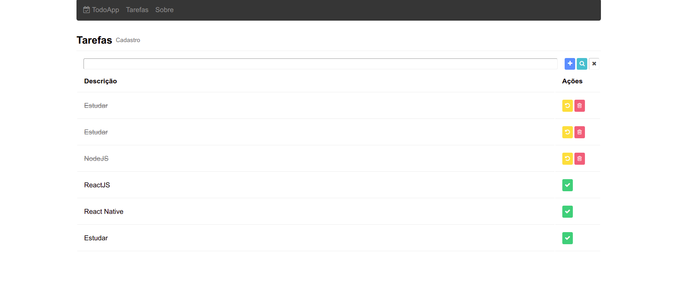

# TodoApp

An simple application for task management

## About the Project



## Built With

### Frontend
```
React
```
```
Css
```
```
Html
```

### Backend
```
MongoDB
```
```
NodeJS
```
```
Express
```

## Prerequisites

* [React](https://reactjs.org/)

* [NodeJS](https://nodejs.org/en/download/)

* [MongoDB](https://www.mongodb.com/)

### Installing

Clone the repo

```
https://github.com/matheusleal-code/Todo-App.git
```

install NPM packages

```
npm install
```

## Built With

* [React](https://reactjs.org/) - The JavaScript framework used
* [Nodejs](https://nodejs.org/en/download/) - The web backend javascript 
* [MongoDB](https://www.mongodb.com/) - The database used

## Authors

* **Matheus Leal**
